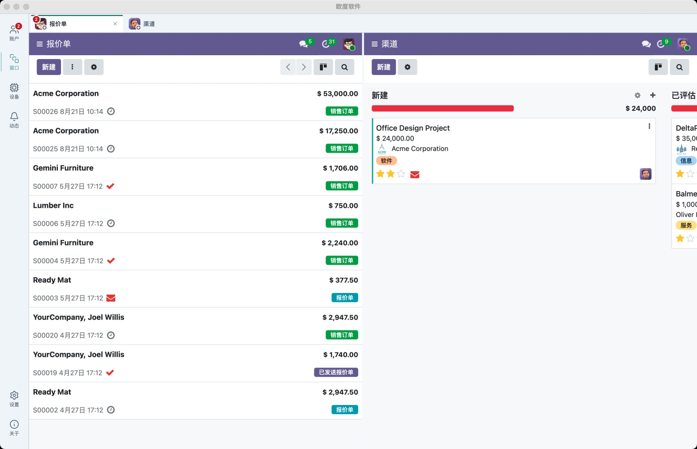
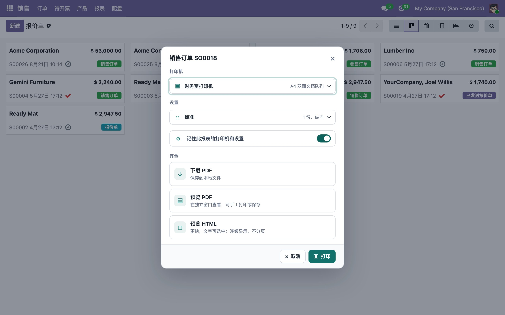
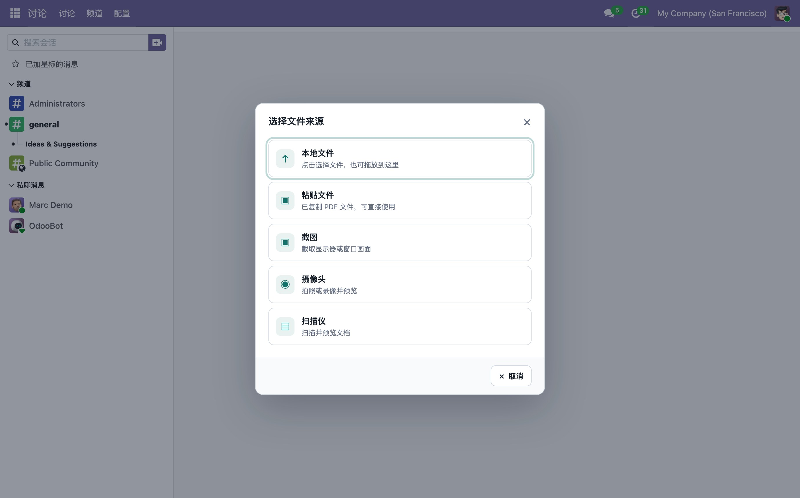

# Oudu Addons

Official server-side modules for **OuduDesktop** — the native desktop client for Odoo 08–19 on Windows, macOS and Linux. Run multiple Odoo instances and accounts side by side, each with its own isolated session, and bring native desktop capabilities (direct report printing, device center, native notifications) to your Odoo.

## Modules

| Module | Series | Summary |
| ------ | ------ | ------- |
| `oudu_desktop` | 19.0, 18.0 (in development) | OuduDesktop companion: capability handshake, desktop guide page, and native desktop integration for Odoo instances. |

## OuduDesktop

OuduDesktop is a standalone native client for Odoo's split front-end/back-end architecture: the server stays a standard, unmodified Odoo, while the client hosts Odoo's own OWL front-end with per-instance session isolation.

- **Multiple instances in parallel** — several Odoo servers, or several accounts on the same server, online and usable at the same time.
- **Native printing & device center** — send Odoo reports straight to system and network printers, with print history and routing.
- **Native experience** — tray, notifications, badges, download handling, global shortcuts.

**Free download: https://desktop.oudu.top**

## Compatibility

| Odoo series | 19.0 | 18.0 | 17.0–8.0 |
| ----------- | ---- | ---- | -------- |
| `oudu_desktop` | 🚧 | 🚧 | backfilling |

## Installation

Copy the module directory for your Odoo series into your `addons` path, update the apps list, and install. Full functionality requires the OuduDesktop client; the modules also install and run in a plain browser.

## Repository layout

- `main` — this landing page only.
- `19.0`, `18.0`, … — per-series branches carrying the module code for that series (registered with the Odoo Apps store).

Website: https://www.oudu.net ｜ Contact: info@oudu.net ｜ License: LGPL-3

---

## 中文简介

本仓库是 **OuduDesktop** 的官方服务器端模块仓库。OuduDesktop 是覆盖 Windows / macOS / Linux 的 Odoo 原生桌面客户端，支持 Odoo 08–19 多实例、多账号同时并行使用：多窗口编排、系统打印与设备中心、原生通知、按实例会话隔离。

- **免费下载**：https://desktop.oudu.top
- 每个 Odoo 系列对应一个独立分支（`19.0`、`18.0`……），模块代码在对应分支内，复制到 addons 目录即可安装；
- 模块在纯浏览器中也可正常安装运行，配合 OuduDesktop 客户端可获得完整原生能力。

官网：https://www.oudu.net ｜ 联系：info@oudu.net ｜ 协议：LGPL-3
